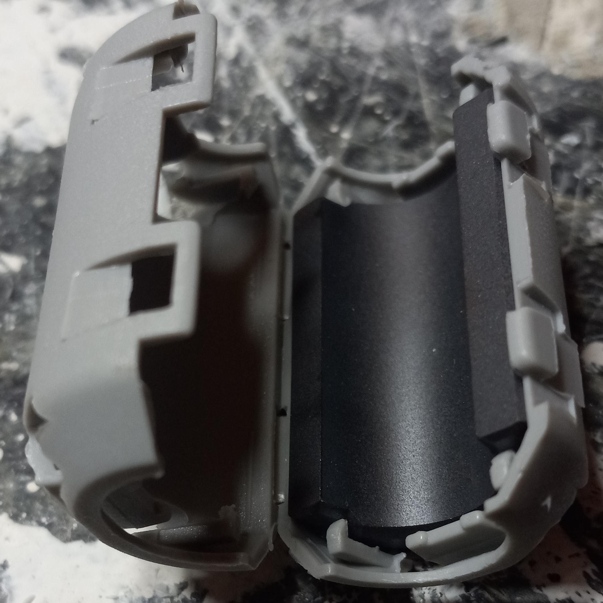
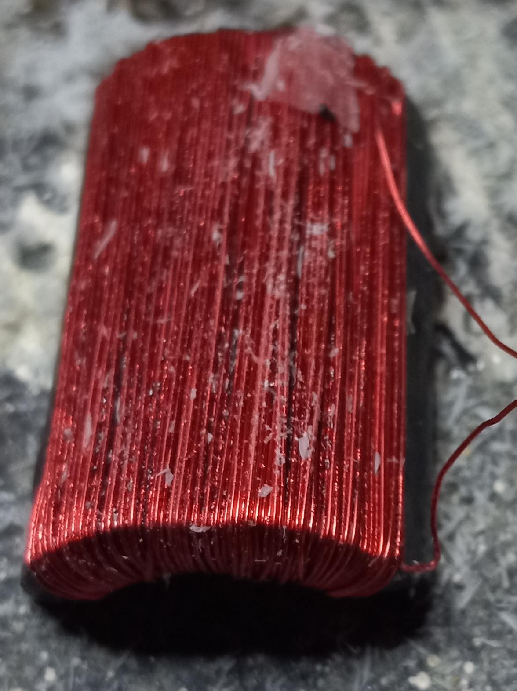
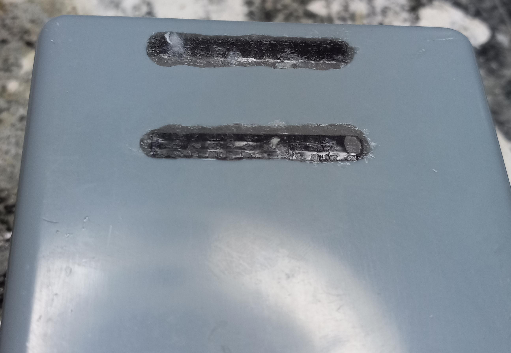
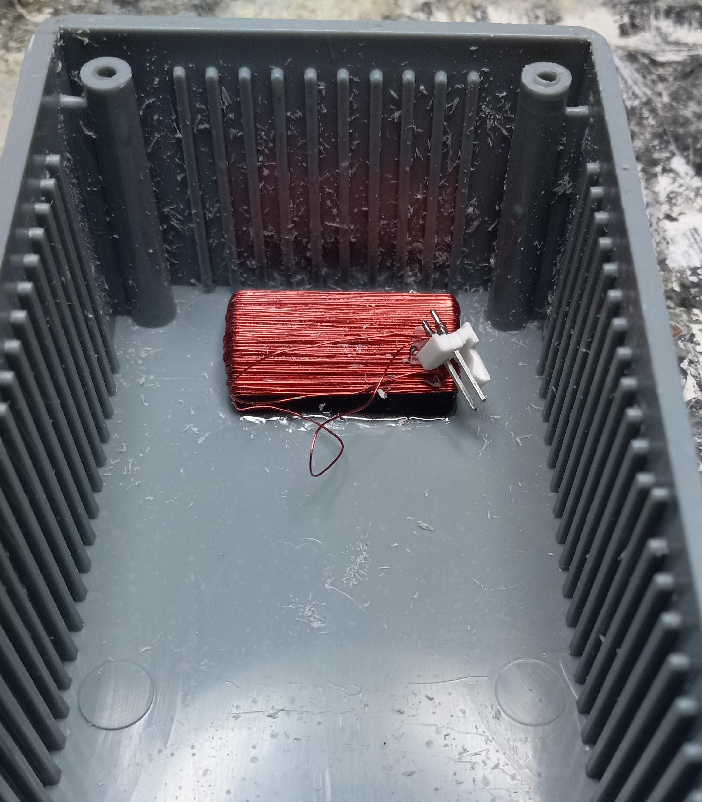
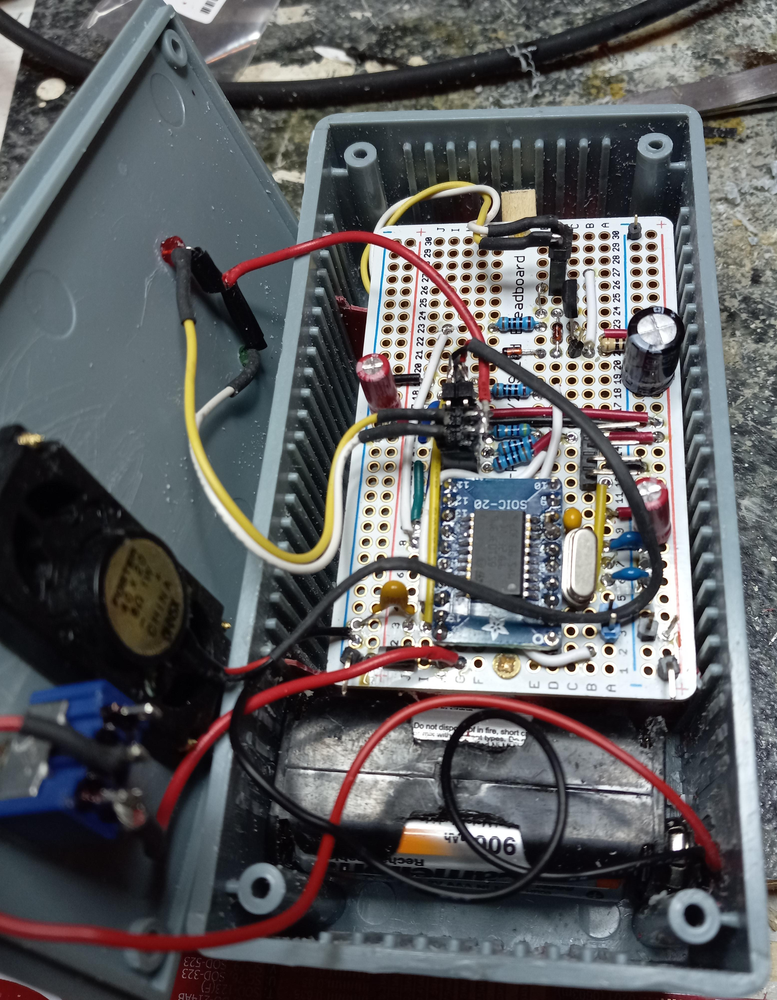
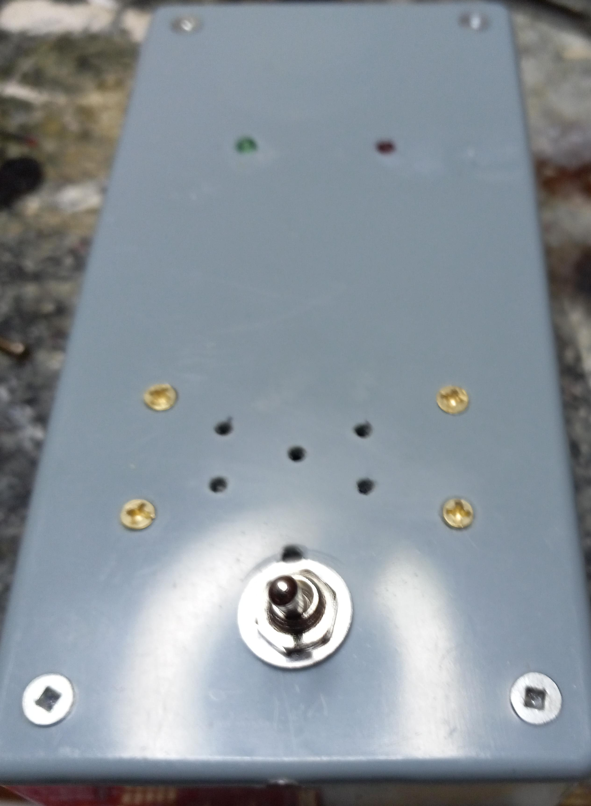
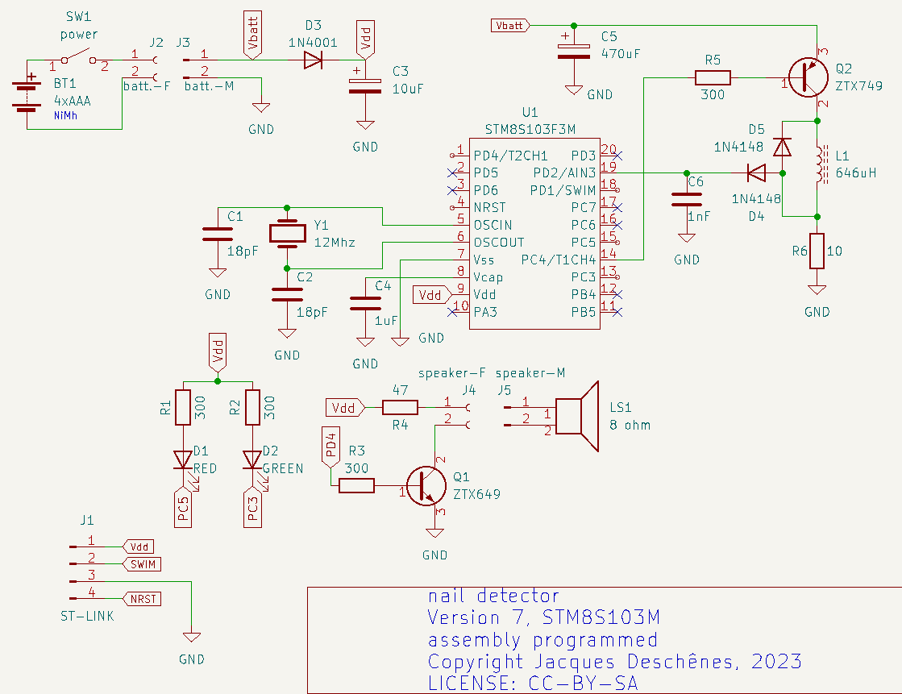

# Version 7 
### 2023-04-05

Last modification du circuit, new coil to increase detection area I replace the rod wounded coil by half cylindral wounded coil. The inductance is a little higher 646µH instead of 622µH. 
For this coil I used half of cable ferrite as core. 

I remove one half from plastic shell to use as core. Using 30 AWG enameled wire . With 2 layers of this wire I measured 644µH. 

.jpg)

I cutted 2 slot at the bottom of the box to push the coil edges flush to it an used epoxy glue to hold in place.

Demo video [here](https://youtu.be/uCpbacAko6Q).

## 2023-03-29 

* Improved sensivity. 

* Tried a new coil on rod ferrite. [rod datasheet](ferrite-rod-4077484611.pdf).

* Updated firmware [nail-finder.v6.asm](nail-finder.v6.asm).

After many different circuits test I decided for the following circuit giving the best result.
* Use **STM8S103F3M**  SOIC-20 format  MCU. 
* Coded in assembly [nail-finder.v6.asm](nail-finder.v6.asm).

I'm waiting for an ordered ferrite to test new coil idea before doing a final assembly.

### How it works 

The working principle is different from previous version. Instead on measuring difference in voltage induced by varying resonnance frequency.  It measure variations in voltage induce by variation in time constant of **L-R** circuit.   

A short pulse is sent to **L1-R4** circuit. Voltage at **R4** increase exponentially in relation to Time constant **T=L/R**.  Metal nearby **L1** change its inductance hence the time constant variation. The duration of pulse is chosen to be short enough that the voltage at **R1** never reach Vdd (current through L1-R1 never reach its maximum). Hence the voltage at end of pulse depend on time constant.

This circuit prove to be very reliable in stability and the **L1** ferrite core improve sensitivity. 

# version 6 

* best result up to date. 
    * improved sensivity 
    * very few false alarms. 

[new software](nail-finder.v6.asm) and new circuit. 

 

The inductor **L7** is 26 AWG enamel wire wounded on a ferrite rod recuperated from old radio. 
The rod is 7mm diameter. The winding is 2 layers 3 cm in length. The measure inductance is 821uH.

# version 4 

### 2023-03-22 

La configuration tested. Use a coil on ferrite rod.

This version is programmed on **STM8S103F3M" in assembly. Still in development. 

# Version 3 

This version in programmed on **STM8S105K6B6** in assembly.

