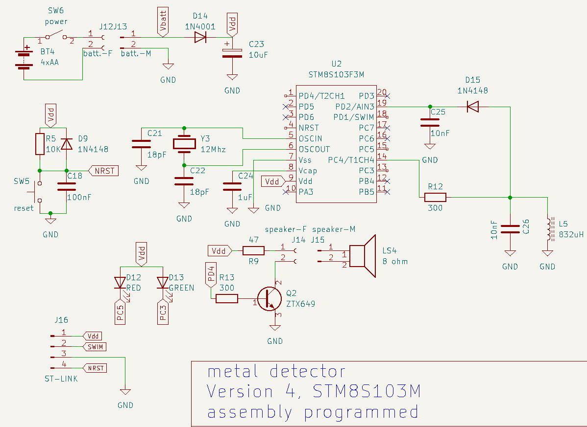

# version 6 

* best result up to date. 
    * improved sensivity 
    * very few false alarms. 

[new software](nail-finder.v6.asm) and new ciruit. 

 

The inductor **L7** is 26 AWG enamel wire wounded on a ferrite rod recuperated from old radio. 
The rod is 7mm diameter. The winding is 2 layers 3 cm in length. The measure inductance is 821uH.

# version 4 

### 2023-03-22 

La configuration tested. Use a coil on ferrite rod.

This version is programmed on **STM8S103F3M" in assembly. Still in development. 

# Version 3 

This version in programmed on **STM8S105K6B6** in assembly.

