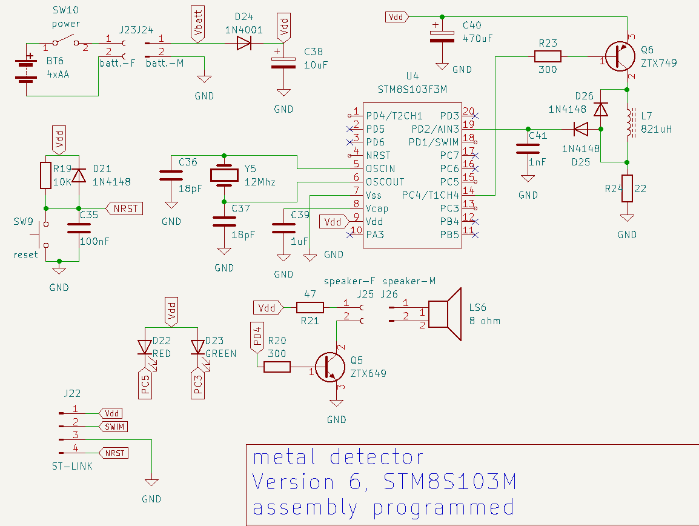

### 2023-03-24 

* Modification de [debug.asm](debug.asm) pour réception des caractères en mode interruption. Ce qui permet d'utiliser **CTRL+C** pour réinitialiser le MCU pendant les sessions de débogage.

* Test supplémentaires avec différentes bobines et largeur d'impulsion sans résultat convaincant.

### 2023-03-23

6ième version du projet. Meilleur résultat à date. 
    * plus sensible. 
    * Faux déclechements très rares.

 Nouveau programme [bare-metal/nail-finder.v6.asm](bare-metal/nail-finder.v6.asm) et nouveau circuit avec mode de fonctionnement différent. 

 

 L'inductance utilisée est bobinée avec du fil émaillé 26 AWG en spire jointives sur une barre de ferrite de 7mm de diamètre récupérée d'un vieille radio. Le bobinage débute à 7 mm de l'extérmenté et s'étant sur 3 cm, avec 2 couches de fil. La valeur d'inductance mesurée est de 821uH.    

### 2023-03-22

* Autre test avec différentes confuguration. Finalement je suis passé à un circuit résonnant parrallèle.  

### 2023-03-21

* Testé différent type d'inductance. Le meilleur résultat est obtenu avec une inductance bobiné sur une ferrite de 7mm de diamètre. 

* Modification de la schématique. 

* Écrire et tester le programme [bare-metal/s103f3-metal-pointer.asm](bare-metal/s103f3-metal-pointer.asm)

### 2023-03-19

* Création de schématique de la version 4 utilisant un MCU **STM8S103F3M**. 

* Réorganisation du [readme.md] principal.

* Ajout d'une double tonalité d'alarme pour différencier l'approche de l'éloignement. 

* Ajout du mode de détection **MODE_2** pour fin de test.

### 2023-03-17

* Modification au circuit de la version 2. 
    * Modification de la valeur du condensateur C8. Était de **100nF** remplacé par **10nF**. 
    * Suppression de la résistance de 5M1 qui était en parrallèle avec **C8**.

### 2023-03-16 

* Premier commit du dossier **bare-metal**. 

### 2023-03-09 

* Version 3 
    * Création de la feuille [bare-metal.kicad_sch](KiCAD/bare-metal.kicad_sch) dans KiCAD
    * Création du dossier **bare-metal**. Cette version est progreammée en assembleur sur **STM8S105K6B6**.

* Création de la feuille dans KiCAD pour la **version 2** qui n'utilise pas de cristal externe mais plutôt le signal **TMCO** de 8Mhz en provenance du ST-LINK. 

* Modification de [metal-detector.bas](metal-detector.bas) pour tenir compte de la dernière réversion de [STM8_TBI](https://github.com/picatout/stm8_tbi) qui ajoute les commandes **CLK_HSE** et **CLK_HSI** pour faire la commutation entre l'oscillateur  interne et l'oscillateur externe.

### 2023-03-08 

* [metal-detector.bas](metal-detector.bas) Révision 3
    * Modifié la constante  **SENSIVITY**  de **4** à **2** pour amélliorer la sensibilité. 
    * Ajout de la constante **DEBUG** et modifié le code pour n'interagir avec le terminal lorsque **DEBUG=1**
    * Sauvegarder le programme en flash 
    * Utililsé la commande **AUTORUN DETECTOR** pour exécuter le programme lors de la mise sous tension du détecteur.
    
### 2023-03-07

* Version 1 révision 2
    * Changement au circuit ainsi qu'au programme [metal-detector.bas](metal-detector.bas)

### 2023-03-03

* Mise à jour du [readme.md](readme.md)

* Création du dépot sur [https://github.com/picatout/metal-pointer](https://github.com/picatout/metal-pointer)

* Modification du circuit pour ajouter un cristal de 12Mhz pour la carte NUCLEO-S207K8

* Création du programme [clk-switch.bas](clk-switch.bas) qui permet de commuter de la carte NUCLEO 
de l'oscillateur interne **HSI** au cristal 12Mhz **HSE**. 

* Mise à jour du programme [metal-detector.bas](metal-detector.bas) pour fonctionner avec le cristal 
externe au lieu de l'oscillateur interne.

* Mise à jour du fichier 

### 2023-03-02

* Ajout du programme [tunig.bas](tuning.bas)

### 2023-03-01

* Remplacement de stm8_eforth par stm8_tbi sur la carte NUCLEO-S207K8

* Création du fichier [metal-detector.bas](metal-detector.bas)

### 2023-02-20

* Création du projet 

* Installation de stm8_eforth sur la carte NUCLEO-S207K8 

