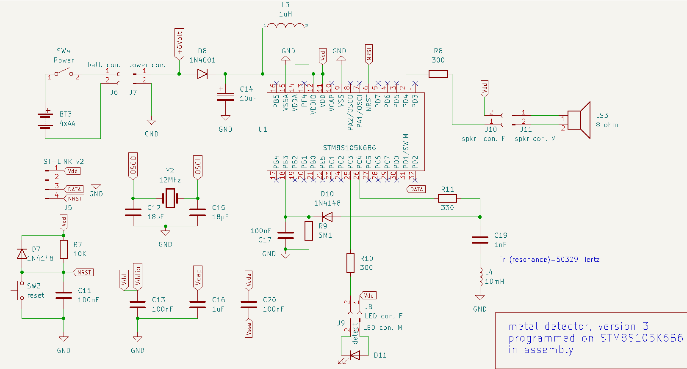

# Pin point metal detector 

This is a pin point metal detector using a NUCLEO-8S207K8 module with [stm8_tbi](https://github.com/picatout/stm8_tbi).

The Tiny BASIC application  [metal-detector.bas](metal-detector.bas)

* [revision notes](#revisions) 

## Schematic, version 2

## prototype, version 1

## Working principle

**C6** and **L1** form a series resonance circuit which frequency is 
Fr=1/(2 * 3.1416 * sqrt(1e-9*10e-3))=50329 Hertz 

**PWM** Channel 4 is used to generate a frequency at or near resonnance. This signal is injected in C4-L1 through R3. At resonant frequency voltage at junction R3-C4 is minimum.
This voltage is rectified by diode **D3** and measured by the analog/digital converter on channel **A3**. 

When a metal object come close to **L1** it modify the inductance then **C6-L1** resonnance is no more at PWM frequency and the voltage increase at **R3-C6** junction. An alarm is then sounded for 10msec and the GREEN LED **D2** light up. 

12Mhz crystal **Y1** is added to the NUCLEO-S207K8 board to increase frequency stability.

**L1** is a commercial inductor wound on a ferrite core. 

## Revisions 

### version 3 (STM8S105KBB6) R2

* Added double tonalities to alarm to distinguish between *going closer* and *going further*. For steel going closer generate higher pitch and going further generate lower pitch. For nickel it is the opposite.

* Added a buffer transistor to speaker as the sounding alarm was dropping *Vdda* affecting sample reading.

.png)

### version 3  (STM8S105KBB6) R1

Bare metal programming in assembly on STM8S105K6B6. 

### Version 2 

* Sheet **version 2** in KiCAD schematic. In this version the external 12Mhz crystal is discarded. The **SB5** bride on NUCLEO board is closed which bring 8Mhz **TMCO** signal to STM8 PA1 pin.
This version of metal detector use new command **CLK_HSE** from last version of [STM8 Tiny BASIC](https://github.com/picatout/stm8_tbi).

.png)

### Revision 3 

* I had wrongly connected cathode of **D1** to **CN4:4 (Vin)**  instead of **CN4:1 (5V)**.    

.png)

[short video demo](https://youtube.com/shorts/o5VKi-kE5qI?feature=share) 

### Revision 2 

*  Modified schematic and [metal-detector.bas](metal-detector.bas) to improve sensitivity. 

