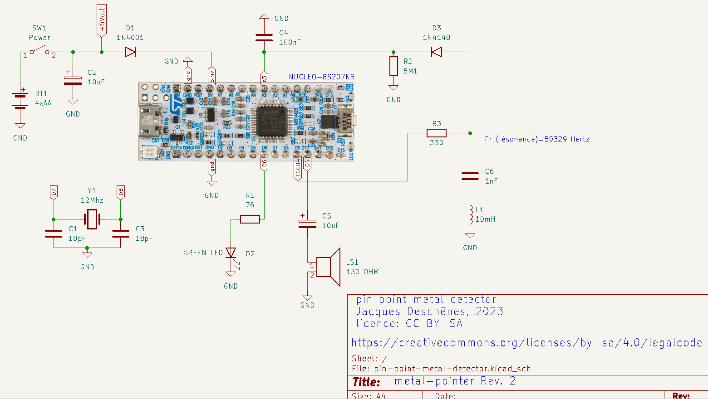

# Pin point metal detector 

This is a pin point metal detector using a NUCLEO-8S207K8 module with [stm8_tbi](https://github.com/picatout/stm8_tbi).

The Tiny BASIC application  [metal-detector.bas](metal-detector.bas)
 
## Schematic, version 1

## prototype, version 1

## Working principle

**C6** and **L1** form a series resonance circuit which frequency is 
Fr=1/(2 * 3.1416 * sqrt(1e-9*10e-3))=50329 Hertz 

**PWM** Channel 4 is used to generate a frequency at or near resonnance. This signal is injected in C4-L1 through R3. At resonant frequency voltage at junction R3-C4 is minimum.
This voltage is rectified by diode **D3** and measured by the analog/digital converter on channel **A3**. 

When a metal object come close to **L1** it modify the inductance then **C6-L1** resonnance is no more at PWM frequency and the voltage increase at **R3-C6** junction. An alarm is then sounded for 10msec and the GREEN LED **D2** light up. 

12Mhz crystal **Y1** is added to the NUCLEO-S207K8 board to increase frequency stability.

**L1** is a commercial inductor wound on a ferrite core. 

## Revisions 

### Revision 2 

*  Modified schematic and [metal-detector.bas](metal-detector.bas) to improve sensitivity. 

